<a id="top"></a>

# The Bil Guide

## Overview

**Bil**: a variant of Go for parallel processors.

Bil and Go both have concurrency models that are heavily inspired by Hoare’s CSP. 

Go is a general-purpose language that borrows CSP’s channel-and-process ideas but relaxes them with buffering, dynamic concurrency, and conventional shared-memory mechanisms

Bil is designed specifically for parallel processor systems; influenced by CSP, by Go and by May's occam. Built on the Go toolchain, it constrains and shapes the Go concurrency model to encourage a higher level of discipline as needed by parallel systems. Bil helps coders to reason about their process models and to selectively place processes on physical processors.

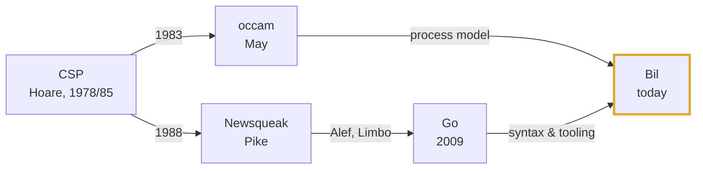

Bil is intended for parallel processor systems, but also efficiently supports single processor and multicore shared memory processor architectures for easier reasoning about concurrent code, software development and educational purposes. A Bil emulator (`WASM`) implements a parallel processor mesh to model and test massively parallel systems.

---

This document provides an introduction to the [Bil language](https://bil-lang.org) by way of a series of worked examples. Bil is a variant of the [Go language](https://go-lang.org) and a working knowledge of Go is assumed.

Follow the installation and run code instructions in [Getting Started](#bil-start) to follow along on your own machine.

## Table of Contents

- [Section I: Introduction by Example](#section-i)
  - [Example 1: Two processes and a channel](#example-1)
  - [Example 2: Process declaration](#example-2)
  - [Example 3: Waiting on several channels](#example-3)
  - [Example 4: Skip and stop](#example-4)
  - [Example 5: Channel protocols](#example-5)
  - [Example 6: Replicated parallel (worker farm)](#example-6)
  - [Example 7: Data-parallel scatter/gather](#example-7)
  - [Example 8: Replicated alternation (many-to-one server)](#example-8)
  - [Example 9: Priority guards](#example-9)
- [Section II: Theory of Operation](#section-ii)
  - [Getting Started](#bil-start)
  - [Bil Features](#bil-features)
  - [Bil Checks](#bil-checks)
  - [AI Cheatsheet](#ai-cheatsheet)
- [Section III: Hinterland](#section-iii)
  - [The Bil Project](#bil-project)
  - [Bil Rationale](#bil-rationale)
  - [Bil and Go](#bil-and-go)
  - [Further reading](#further-reading)
- [Section IV: Further Bil](#section-iv)
  - [Example 10: Buffer process](#example-10)
  - [Example 11: Dining philosophers](#example-11)
  - [Example 12: Recursive processes](#example-12)
  - [Example 13: Pipeline (Sieve of Eratosthenes)](#example-13)
  - [Example 14: Poison-pill shutdown cascade](#example-14)
  - [Example 15: Semaphore process](#example-15)
  - [Example 16: Barrier synchronization](#example-16)
  - [Example 17: Token ring](#example-17)
  - [Example 18: NxM Mandelbrot](#example-18)

<a id="example-1"></a>

---

<a id="section-i"></a>

## Section I: Introduction by Example

### Example 1: Two processes and a channel

A Bil **process** is a code unit that can be run in **parallel** with other processes. Processes can be run in any order. Processes can be run in parallel by placing them on multiple physical processors. Processes can be run concurrently on a single processor. Processes do not share memory. Processes may be nested.

A Bil **channel** is a unidirectional, bilateral process-to-process message passing interface. One process outputs data to a channel with `<-`, the other inputs data with `->`. Channels are unbuffered: the sender blocks on output and the receiver blocks on input. Channels may be placed on physical point-to-point interprocessor links.

A `seq {}` block contains a list of expressions that are run in _sequence_. When a `seq` is entered, each expression is run in the specified order. When the last expression finishes, the block is done and the program proceeds.

A `par {}` block contains a list of expressions that are run in _parallel_. When a `par` is entered, a each expression is run independently on a dedicated thread with its own memory (a _fork_). When all expressions are finished, the block is done (a _join_) and the program proceeds.

_In regular Go, processes (i.e. goroutines) can share memory freely with each other and channels can be buffered. In contrast, by avoiding shared memory dependencies and associated race conditions, Bil's model facilitates the placement of parallel processes onto multiple physical processors (and channels to links) for large scale parallelism. When Bil parallel processes share a processor, they run concurrently as time-sliced threads (i.e. as isolated goroutines), taking advantage of multiple cores if available._

```go
package main

func main() {
	c := make(chan int)

	par {
		seq {
			c <- 42
			c <- 99
		}
		seq {
			var x, y int
			c -> x
			c -> y
			println(x)
			println(y)
		}
	}
}
```

#### Topology

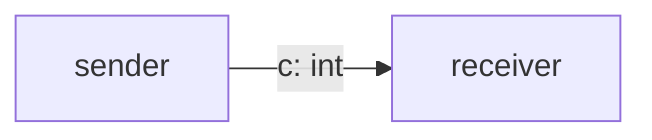

[^^](#top)

---

<a id="example-2"></a>

### Example 2: Process declaration

A Bil **process** can be declared with `proc` to indicate a code unit intended to be run as an independent process. A `proc` is analagous to a Go `func` and they may be mixed freely: a `proc` may call a `func` and a `func` may call a `proc`. Bil checks both `proc` and `func` blocks for the same parallel constraints.

```go
package main

proc sender(c chan<- int) {
	c <- 42
	c <- 99
}

proc receiver(c <-chan int) {
	var x, y int
	c -> x
	c -> y
	println(x)
	println(y)
}

func main() {
	c := make(chan int)

	par {
		sender(c)
		receiver(c)
	}
}
```

#### Topology


[^^](#top)

---

<a id="example-3"></a>

### Example 3: Waiting on several channels

An `alt {}` block waits on whichever of several channel operations becomes ready first, then runs that one _alternative_.

```go
package main

import "time"

proc server(request <-chan int, shutdown <-chan bool) {
	var x int
	var sd bool

	for {
		alt {
			request -> x {
				println(x)
			}
			time -> After(1 * time.Second) {
				println("tick")
			}
			shutdown -> sd {
				if sd {
					return
				}
			}
		}
	}
}

func main() {
	request  := make(chan int)
	shutdown := make(chan bool)

	par {
		server(request, shutdown)
		seq {
			request  <- 1
			request  <- 2
			time.Sleep(3 * time.Second)
			request  <- 3
			shutdown <- true
		}
	}
}
```

Running it: prints `1`, `2`, `tick`, `tick`, `3`, then **exits cleanly**.

#### Topology

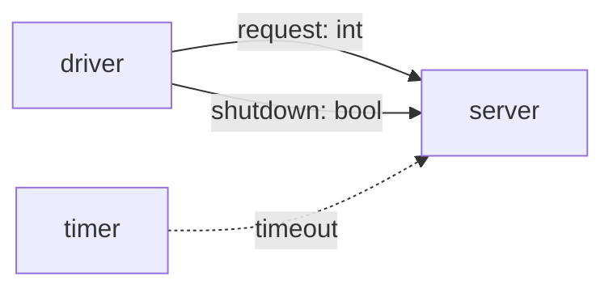

[^^](#top)

---

<a id="example-4"></a>

### Example 4: Skip and stop

Bil implementaion of occam's useful pair: `skip` terminates immediately (does nothing, succeeds); `stop` never terminates (deliberate, inert halt). A `skip {}` block acts as the default guard for an `alt` - if no channel is ready, then the skip blocks is executed.

```go
package main

import "time"

proc poller(c <-chan int) {
	var x int
	for {
		alt {
			c -> x {
				if x >= 0 {
					println(x)
				} else {
					stop
				}
			}
			skip {
				println("skip")
			}
		}
		time.Sleep(100 * time.Millisecond)
	}
}

proc sender(c chan<- int) {
	time.Sleep(150 * time.Millisecond)
	c <- 42
	time.Sleep(150 * time.Millisecond)
	c <- -1
}

func main() {
	c := make(chan int)

	par {
		poller(c)
		sender(c)
	}
}
```

#### Topology

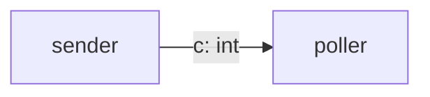

[^^](#top)

---

<a id="example-5"></a>

### Example 5: Channel protocols

Typed, structured messages over a _channel_, including variant/tagged protocols dispatched with a plain Go type-switch. Everything sent so far has been a bare `int`/`bool`; first example needing compound data and message-shape checking. Two independent demos, run one after the other (not concurrently — see design notes for why): a `Point` protocol (`X`, `Y` sent together as one atomic message) shows the plain structured case; a `LogMsg` protocol (tagged `Info`/`Warn`, each carrying an `INT`) shows the variant case.

```go
package main

type Point struct {
	X, Y int
}

type LogMsg interface {
	isLogMsg()
}

type Info struct {
	Code int
}

func (Info) isLogMsg() {}

type Warn struct {
	Code int
}

func (Warn) isLogMsg() {}

proc pointSender(out chan<- Point) {
	out <- Point{X: 1, Y: 2}
	out <- Point{X: 3, Y: 4}
}

proc pointReceiver(in <-chan Point) {
	var p Point
	for range 2 {
		in -> p
		println(p.X, p.Y)
	}
}

proc logSender(out chan<- LogMsg) {
	out <- Info{Code: 1}
	out <- Warn{Code: 2}
	out <- Info{Code: 3}
}

proc logReceiver(in <-chan LogMsg) {
	for range 3 {
		switch v := (<-in).(type) {
		case Info:
			println("info", v.Code)
		case Warn:
			println("warn", v.Code)
		}
	}
}

func main() {
	points := make(chan Point)
	par {
		pointSender(points)
		pointReceiver(points)
	}

	logs := make(chan LogMsg)
	par {
		logSender(logs)
		logReceiver(logs)
	}
}
```

Running it prints `1 2`, `3 4`, `info 1`, `warn 2`, `info 3` — deterministically.

#### Topology

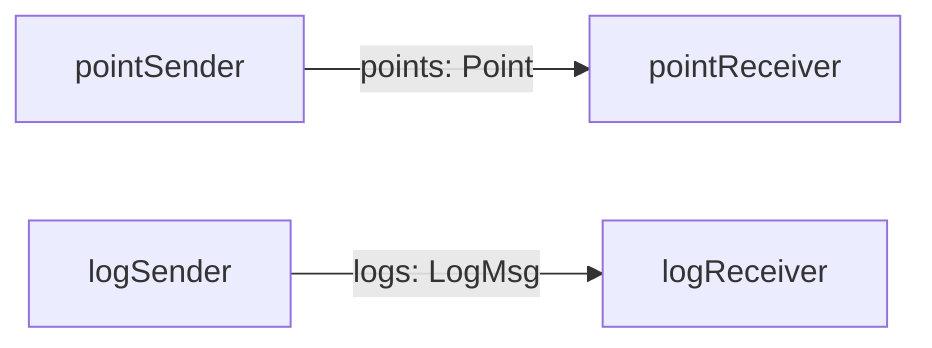

[^^](#top)

---

<a id="example-6"></a>

### Example 6: Replicated parallel (worker farm)

`par i := range N {}` denotes a replicated parallel — an array of identical worker processes over an array of channels. A farmer distributes one item to each of N workers, then collects the N results in order — the whole thing is a complete runnable program.

```go
package main

const N = 3

proc worker(in <-chan int, out chan<- int) {
	var x int
	in -> x
	out <- x * x
}

func main() {
	toWorker := makeChans[int](N)
	fmWorker := makeChans[int](N)

	par {
		par i := range N {
			worker(toWorker[i], fmWorker[i])
		}
		seq {
			for i := range N {
				toWorker[i] <- i + 1
			}
			for i := range N {
				println(<-fmWorker[i])
			}
		}
	}
}
```

Running it prints `1`, `4`, `9` — deterministically: the collecting loop reads `fmWorker[0]`, then `[1]`, then `[2]` in that fixed order, and each read just blocks until that specific worker's unbuffered send is ready, regardless of which worker actually finishes first.

#### Topology

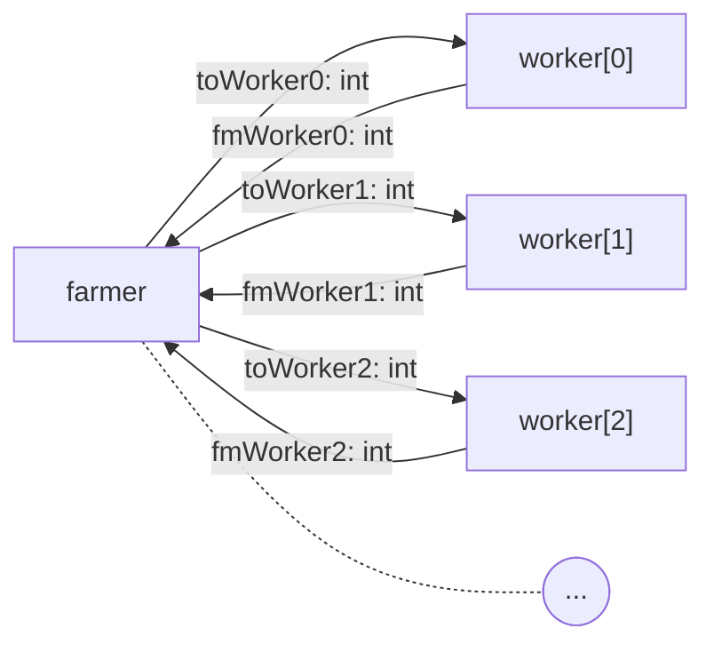

[^^](#top)

---

<a id="example-7"></a>

### Example 7: Data-parallel scatter/gather

Split an array across replicated workers, each computes a partial result, fan back in and combine. A genuine parallel *algorithm*. `N = 4` workers each sum their own chunk of a 12-element array; a gather step sums the 4 partial sums into a total. Deliberately flat, not recursive, built with a `splitN` to produce disjoint chunks of the data array plus a replicated `par` and a self-calling `proc`.

```go
package main

const n = 4

proc worker(chunk []int, result chan<- int) {
	sum := 0
	for _, v := range chunk {
		sum += v
	}
	result <- sum
}

func main() {
	data := []int{1, 2, 3, 4, 5, 6, 7, 8, 9, 10, 11, 12}
	chunks := splitN(data, n)
	results := makeChans[int](n)

	par {
		par i := range n {
			worker(chunks[i], results[i])
		}
		seq {
			total := 0
			for i := range n {
				var partial int
				results[i] -> partial
				total += partial
			}
			println(total)
		}
	}
}
```

Running it prints `78` (1+2+...+12) — deterministically.

#### Topology

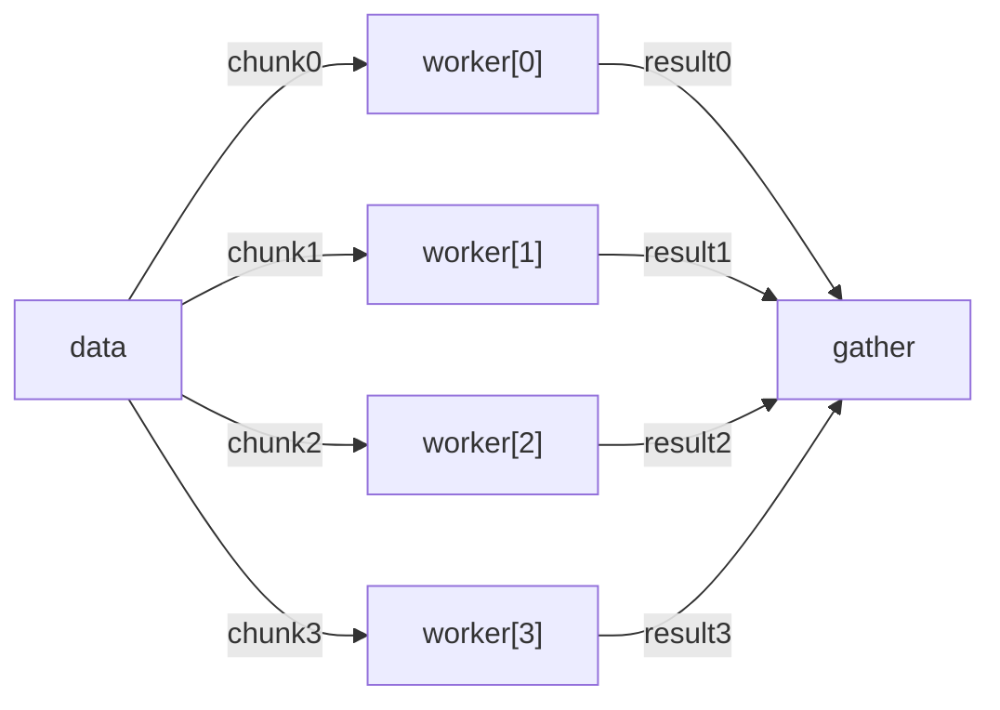

[^^](#top)

---

<a id="example-8"></a>

### Example 8: Replicated alternation (many-to-one server)

`alt _ := range nClients` — one process listening across N channels at once. `nClients = 3` clients each send `perClient = 2` requests on their own channel; one `server` process `alt`s across all 3 channels at once, printing whatever arrives, until it's received all 6 — a many-to-one fan-in. `v` below is bound with `:->`, not `->` — a replicated `alt` guard takes the same declare-vs-assign choice as any other receive (see the `alt` reference section), and `:->` is what lets `v` be introduced right here instead of needing a `var v int` above the loop.

```go
package main

const nClients = 3
const perClient = 2

proc client(id int, out chan<- int) {
	for i := range perClient {
		out <- id*100 + i
	}
}

proc server(chans []chan int) {
	for range nClients * perClient {
		alt _ := range nClients {
			chans[_] :-> v {
				println(v)
			}
		}
	}
}

func main() {
	chans := makeChans[int](nClients)
	par {
		par i := range nClients {
			client(i, chans[i])
		}
		server(chans)
	}
}
```

Running it: **6/6 runs checked, content always exactly `{0, 1, 100, 101, 200, 201}`** (each client's two values, `id*100+i`) — order genuinely varies run to run, same non-determinism class as dining philosophers — real concurrent contention for `server`'s attention. 

#### Topology

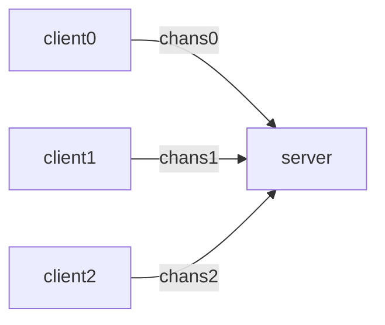

[^^](#top)

---

<a id="example-9"></a>

### Example 9: Priority guards

Priority-ordered guard selection. Regular `alt` (like Go's `select`) picks pseudo-randomly among ready cases with no priority concept. The keyword combination `pri alt {}` denotes a specialized `alt {}` block where the order of branches set's the priority of each branch.

Here, `server` drains a `high` channel before ever touching `low` when both are ready — a `highSender` and `lowSender` each send `TOTAL = 5` values concurrently, and `server` must always prefer `high`.

```go
package main

import "time"

const total = 5

proc highSender(high chan<- int) {
	for i := range total {
		high <- i
	}
}

proc lowSender(low chan<- int) {
	for i := range total {
		low <- i
	}
}

proc server(high <-chan int, low <-chan int) {
	for range 2 * total {
		time.Sleep(5 * time.Millisecond)
		pri alt {
			high -> _ {
				println("high")
			}
			low -> _ {
				println("low")
			}
		}
	}
}

func main() {
	high := make(chan int)
	low := make(chan int)
	par {
		server(high, low)
		highSender(high)
		lowSender(low)
	}
}
```

Running it: **5/5 runs, exactly `high` × 5 then `low` × 5, every time, exit 0**. Confirmed this by running the identical scenario with plain `alt` instead: genuinely random ordering, one run even came back `low` × 5 then `high` × 5, the exact opposite of intended priority — proving Go's `select` really doesn't favor either side, so the ordering seen with `pri alt` isn't circumstantial. Adding a 5ms sleep before every `server` iteration gives both senders time to actually be blocked-and-ready before the check happens, and with that, priority holds 5/5 — the sleep isn't part of what `pri alt` does, it's what the *test* needed to reliably force genuine contention.

#### Topology

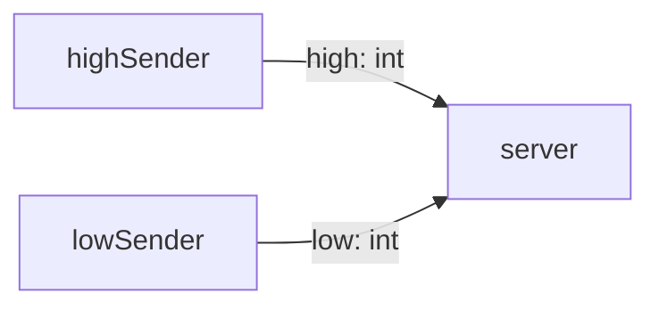

[^^](#top)

---

<a id="section-ii"></a>

## Section II: Theory of Operation

<a id="bil-start"></a>

### Getting Started

Build the `bil` tool once (`cd tools/bil && go build -o bil .`), then run a `.bil` file with:

```
tools/bil/bil run examples/01-twoprocs.bil
```

`bil run` chains together Bil's two internal tools, failing at the first step that doesn't pass rather than running anything it hasn't checked:

1. **`tools/bilc`** — a source-to-source preprocessor (a _transpiler_) that uses `go/scanner` and `go/token` to parse Bil code, apply certain heuristic rules and to provide a set of helper functions. Finally, it uses `go/format` to translate the `.bil` file into legal Go.
2. **`tools/vet`** — a `go/ast`/`go/types`-based static analyzer that checks the transpiled Go against Bil's usage rules (for example: a channel may only be used for input in one `par` branch, and output in one other). A violation is reported and the program is **not** run; `bilc` embeds `//line` directives in the transpiled Go mapping it back to the original `.bil` file and line, so reported positions — and any `go run` compile error or panic — name the `.bil` source, not the generated Go.
3. Only if that passes: calls `go run` on the transpiled Go.

To run steps 1–2 only, without executing the program, use `bil vet` instead of `bil run`.

#### Install

Bil needs a Go toolchain on `PATH` at runtime - get Go from https://go.dev/dl/ if you don't already have it.

On macOS, Linux, etc.:

```
curl -fsSL https://bil-lang.org/install.sh | sh
```

On Windows (PowerShell):

```
irm https://bil-lang.org/install.ps1 | iex
```

These install a prebuilt `bil` binary for your platform, and place it on your `PATH`.

#### Run Bil code

Run a `.bil` file with:

```
bil run examples/01-twoprocs.bil
```

`bil run` chains together Bil's two internal tools:

1. **`tools/bilc`** — a source-to-source preprocessor (a _transpiler_) that uses `go/scanner` and `go/token` to parse Bil code, apply certain heuristic rules and to provide a set of helper functions. Finally, it uses `go/format` to translate the `.bil` file into legal Go.
2. **`tools/vet`** — a `go/ast`/`go/types`-based static analyzer that checks the transpiled Go against Bil's usage rules (for example: a channel may only be used for input in one `par` branch, and output in one other).
3. Only if that passes: calls `go run` on the transpiled Go.

To run steps 1–2 only, without executing the program, use `bil vet` instead of `bil run`.

#### Editor support

There's no dedicated `.bil` grammar yet, but since Bil is close enough to Go syntactically, telling your editor to highlight `.bil` files as Go gets you most of the way there. In VSCode, add this to `settings.json` (workspace or user): `"files.associations": { "*.bil": "go" }`. This just picks the highlighter — it doesn't run `gofmt`/`gopls` against `.bil` files, since they aren't valid Go until `bilc` rewrites them. Other editors / IDEs will have similar settings.

#### Run tests

```
cd tools/bilc
go test ./...
```

This runs `tools/bilc/bilc_test.go` against the fixtures in `tools/bilc/testdata/`: `ok/*.bil` files are transpiled, run, and checked against a matching `*.golden` file; `err/*.bil` files are checked to fail with an error containing the matching `*.err` file's text. To add a regression test, drop a new `.bil` + `.golden` (or `.err`) pair into the right directory — no test code to touch.

`ok/*.bil` fixtures need deterministic output, since they're checked with an exact string match. An example whose output is inherently timing-dependent (e.g. `examples/03-server-alt.bil`, which races a timer against a sleep) is deliberately left out of `testdata/`, and is only meant to be run manually via `bil run`.

`tools/vet` and `tools/bil` have their own `go test ./...` suites, run the same way from within each directory.

#### Build from source

To build it from source instead:

```
cd tools/bil && go build -o bil . && cd ../..
```

(the examples assume `bil` is on `PATH`; if you built from source without moving the binary, run `tools/bil/bil` in its place)

[^^](#top)

---

<a id="bil-features"></a>

### Bil Features

Bil includes a preprocessor (`bilc`) that converts Bil code (`.bil`) to Go code (`.go`) to introduce selected occam features into a modern Go setting. Almost all Go features are preserved in the Bil programming model (types, control flow, expressions, structs, functions, etc.), with the notable exceptions of `go` (i.e. to start a goroutine) and buffered `chan`s. These are replaced by an occam-style Communicating Sequential Parallel (CSP) model which reshapes `go` operations to `par` blocks and performs blocking input and output via unbuffered `chan`s.

---

The following keywords are provided by Bil:

#### `par`

Runs its branches as concurrent goroutines and joins on completion — occam's `PAR`. A static `par{A B}` becomes `par(func(){A}, func(){B})`; the replicated form `par VAR := range N {X}` becomes `parFor(N, func(VAR int){X})`, one goroutine per index.

#### `seq`

Wraps a block to indicate a `par` branch's own sequential body — sugar for a bare `{...}` block (`seq{X}` → `{X}`), provided for readability rather than semantic necessity, since Go statements already execute sequentially by default.

#### `chan ->` and `chan :->`

Receive sugar for `chan`, read left-to-right like occam's `?`. Two forms, mirroring Go's own `=`/`:=` split for a channel receive:

- `c  -> x` is `x  = <-c` — **assign**. `x` must already be declared.
- `c :-> x` is `x := <-c` — **declare**. `x` is introduced right here, and must *not* already be declared.

Either form takes an optional comma-ok suffix, mirroring Go's own two-value channel receive: e.g. `c -> x, ok` is `x, ok = <-c`. Either form takes the Go idiomatic `_` also. Either form generalizes to a receive on a method/function call when the right side is call-shaped (`c -> Method(args)` → `<-c.Method(args)`, e.g. `time -> After(d)`).

#### `proc`

An alias for `func` to indicate a code unit that is intended to be run as an independent process - sugar for a `func`, provided for readability rather than semantic necessity, since Bil checks both `proc` and `func` blocks for the same parallel constraints.

#### `alt`

Waits on whichever of several channel operations becomes ready first, then runs that one branch — occam's `ALT`, rewritten to Go's `select`. Guards read left-to-right (`chan -> target { body }` or `chan :-> target { body }`, echoing occam's `chan ? x`) rather than Go's `case x := <-chan:`; a `(cond) &&` prefix gives a conditional guard, and `VAR := range EXPR {...}` gives the replicated form (one process listening across a runtime-sized set of channels, via `altN`). The bind target's `->`/`:->` choice (see `#### chan ->` above) is the same in every one of these shapes — plain, conditional, or replicated — including the replicated form, where only `VAR` (the winning replica index) is always fresh; that's a property of `altN`'s runtime dispatch, not of which arrow the bind target uses.

#### `pri alt`

Like `alt`, but guards are tried in priority order — the first ready one wins, even if a lower-priority one is also ready. Go's `select` has no priority concept, so this desugars to a cascade of nested `select`s, one per priority level, instead of a single one.

#### `skip` and `stop`

Bil implementaion of occam's useful pair: `skip` terminates immediately (does nothing, succeeds); `stop` never terminates (deliberate, inert halt).

A `skip {}` block also acts as the default guard for an `alt` - if no channel is ready, then the skip blocks is executed. A `skip` statement simply gets dropped.

`stop` rewrites to `time.Sleep(1<<63 - 1)` rather than `select{}`, since Go's runtime treats `select{}` as provably permanent and panics if it's ever the last live goroutine; a pending timer isn't, so it can sit there indefinitely without crashing.

---

The following helper `func`s are provided by Bil as a built in "how to" correctly split an `Array` for distribution across a replicated `par`. Source code is shown here, which may be coped into your own splitter `func` as needed:

#### `splitN`

Splits a slice into `n` disjoint chunks (any remainder folded into the last one), `chunks := splitN(data, n)` — the one sanctioned way to divide a shared array across `par` branches. Chunks are views into the same backing array, not copies; each chunk's disjointness from every other is proven once, by `vet`'s `regions.go`, rather than trusted or re-derived by hand at every call site.

```go
func splitN[T any](s []T, n int) [][]T {
	chunk := len(s) / n
	out := make([][]T, n)
	for i := range n {
		lo := i * chunk
		hi := lo + chunk
		if i == n-1 {
			hi = len(s)
		}
		out[i] = s[lo:hi:hi]
	}
	return out
}
```

#### `splitN2D`

The 2D counterpart of `splitN` — splits a matrix (`[][]T`) into an `nr`×`nc` grid of rectangular tiles, `tiles := splitN2D(matrix, nr, nc)`, each `tiles[i][j]` proven disjoint from every other tile by `vet`'s `grid.go`. A separate function, not a variadic extension of `splitN`: Go generics can't unify a 1D and 2D splitter behind one signature, since the input type itself changes shape with dimensionality (`[]T` vs `[][]T`), not just a type parameter.

```go
func splitN2D[T any](m [][]T, nr, nc int) [][][][]T {
	rchunk := len(m) / nr
	cchunk := len(m[0]) / nc
	out := make([][][][]T, nr)
	for i := range nr {
		r0 := i * rchunk
		r1 := r0 + rchunk
		if i == nr-1 {
			r1 = len(m)
		}
		out[i] = make([][][]T, nc)
		for j := range nc {
			c0 := j * cchunk
			c1 := c0 + cchunk
			if j == nc-1 {
				c1 = len(m[0])
			}
			tile := make([][]T, r1-r0)
			for r := r0; r < r1; r++ {
				tile[r-r0] = m[r][c0:c1:c1]
			}
			out[i][j] = tile
		}
	}
	return out
}
```

[^^](#top)

---

<a id="bil-checks"></a>

### Bil Checks

Bil provides an occam-style Communicating Sequential Parallel (CSP) model where parallel processes can be configured to run as concurrent routines on a single processor, or alternatively as parallel routines spread over multiple physical processors with no shared memory that communicate over bilateral links.

Since the branches of a `par` cannot be guaranteed to have shared memory, the Bil transpiler performs a number of checks across `par` branches to flag code that depends on shared memory, for a `pointer` declared in an outer scope (a free variable) cannot be passed into a `func` in more than one branch.

Five checks are done:

##### par chans

- Each `chan` implements a bilateral communication between two parallel `proc`s. A `chan` is unidirectonal: one `proc` may use it for output and one `proc` for input.

##### par vars

- `vars` which are written in one process of a parallel may not be read by another process in the parallel. A `var` can be used read-only in multiple `proc`s in a parallel if none of the `proc`s write to it.

##### par refs

- Reference types - `pointer`s, `map`s, `interface`s — collapse to one shared rule: a free variable of one of these types touched (any way — read, write, whatever) by more than one `proc` of the same parallel is rejected outright. Confined to a single branch is still fine since no concurrent access is possible.

##### par arrays

- Elements of an array may be written in more than one branch of a parallel if the array subscripts used in each such branch select disjoint parts of the array.

##### par timers

- Any `time` channel can be used for input on mutiple par branches.

[^^](#top)

---

<a id="ai-cheatsheet"></a>

### AI Cheatsheet

Bil is niche enough that most AI coding assistants have never seen it and will confidently write Go-with-buffered-channels-and-`go`-statements instead of real Bil. [`docs/ai-cheatsheet.md`](ai-cheatsheet.md) is a compact, self-contained reference — the ~10 new keywords, the 7 compiler-enforced safety rules, and 5 minimal worked patterns, framed as a delta from Go with a hint of occam, so it leverages the Go and occam knowledge every mainstream model already has.

How to use it: paste the whole file as the first message of a chat (or into a persistent system/custom-instructions slot, or as an attached file) before asking for Bil code — front-loading it is what actually grounds the model. For agentic tools with shell access (Claude Code, Cursor, etc.), it's discoverable directly from the repo and pairs with `bil vet`, which gives a real, automated feedback loop the cheatsheet alone can't: it transpiles and statically checks a `.bil` file against all 7 rules without running anything, so a tool-using AI can self-correct instead of guessing.

[^^](#top)

---

<a id="section-iii"></a>

## Section III: Hinterland

<a id="bil-project"></a>

### The Bil Project

This project, hosted at [https://github.com/bil-lang](https://github.com/bil-lang) consists of several, related components:

1. **Language & compiler frontend** [[.../bil]](https://github.com/bil-lang/bil)
  - Source code transpiler
	  - preprocessor that parses `.bil` files and generates standard `.go` code
	  - includes helper Go functions and checks via syntax heuristics 
  - Static analyser (AST-level)
      - compiler-checked alias/usage safety across `proc`/`par` args
      - concurrent branches never share mutable memory
  - Editor tools
   	  - LSP (VS Code) extensions [tbd]
	  - other editor support (IntelliJ, emacs, vim...)

2. **Emulator & tooling** [[.../emu]](https://github.com/bil-lang/emu)
  - Emulator
    - WASM webpage
	- QEMU mesh [tbd]
	- Docker mesh [tbd]
  - Topology tool (processor → host; channel → link)
  - Bootstrap & loader

3. **Runtime** [tbd]
  - Nano kernel ("Bil scheduler")
  - Footprint tool

4. **General information** [[.../web]](https://github.com/bil-lang/web)
  - Website

_Contributions are very welcome, preferably via a Pull Request. Please open an Issue if you would like to propose a new component._

[^^](#top)

---

<a id="bil-rationale"></a>

### Bil Rationale

_Go's channels/goroutines are compromised CSP, and that's exactly the gap Bil exists to close_

Two separate ways vanilla Go diverges from real CSP, not one:

- **Buffering breaks the rendezvous.** occam has no buffered channels — every communication is a synchronous handshake, sender and receiver both present at the same instant, which is the actual object CSP's process algebra reasons about (traces/failures/refinement, deadlock-freedom proofs). `make(chan T, N)` decouples send from receive in time — a channel plus an implicit buffer process, a weaker object than what CSP theory analyzes. This is why Bil makes "channels are always unbuffered" a hard rule rather than trusting Go's default: vanilla Go doesn't give you the rendezvous property for free, it has to be taken back by force.
- **Goroutines are shared-memory-native, not distribution-native.** occam processes are safely movable onto physically separate processors with disjoint memory specifically because the compiler proves no concurrently-running branch can alias mutable state with another. Goroutines get none of that: they share the whole address space by default, any closure can capture any pointer, and the only backstop is the race detector — dynamic, and it only catches races that actually fire during an instrumented run. That's a shared-memory-multicore design (the M:N scheduler exists to pack goroutines onto cache-coherent cores), not a distributed one.

Rob Pike's "Share Memory By Communicating" (Further reading) is honest read as *idiom advice* — prefer a channel over a mutex-guarded variable when it reads better — but that's a style recommendation a stray pointer can violate at any time, not a structural guarantee the compiler enforces. Bil's version of the same sentence is a checked invariant, not a tip.

[^^](#top)

---

<a id="bil-and-go"></a>

### Bil and Go


#### Differences

Go’s concurrency model was heavily inspired by Hoare’s CSP. Bil's model is different. It is inspired by the occam language CSP model. The main differences are:

| Topic                            | Bil: _Parallel CSP Style_                                                           | Go: _Multicore CSP Style_                                                                   |
| -------------------------------- | ------------------------------------------------------------------------------------ | ---------------------------------------------------------------------------------------------- |
| **Purpose**                      | Designed specifically for parallel processor systems.                                | General-purpose programming language with CSP-inspired concurrency.                            |
| **Processes**                    | Processes are language-level constructs with explicit parallel composition (`par`).  | Goroutines are lightweight functions started with `go`.                                        |
| **Channels**                     | Channels are usually statically declared and form explicit communication topologies. | Channels can be assigned, passed around, stored in data structures, and dynamically connected. |
| **Communication**                | Strict synchronous rendezvous communication. Sender and receiver must meet.          | Supports both synchronous (unbuffered) and asynchronous (buffered) channels.                   |
| **Choice / Guarding**            | Uses `alt` for deterministic or nondeterministic guarded choice.                     | Uses `select`, which chooses among ready communication operations.                             |
| **Process Creation**             | Process structure is typically known statically.                                     | Goroutines can be created dynamically at runtime in large numbers.                             |
| **Scheduling**                   | Processes are constrained goroutines which can be placed on independent processors.  | Goroutines are multiplexed by the Go runtime scheduler onto OS threads.                        |
| **Shared Memory**                | Strong emphasis on communication-only interaction.                                   | Encourages channels, but shared memory with mutexes and atomics is fully supported.            |
| **Type System**                  | Uses Go type system and adds channel protocols.                                      | Modern general-purpose type system with interfaces, generics, libraries, etc.                  |
| **Formal Correspondence to CSP** | Very close to CSP's process algebra origins.                                         | CSP-inspired but pragmatic; many language features fall outside classical CSP.                 |

Conceptually Bil follows the CSP idea more faithfully:

```go
c := make(chan int)

par {
	producer(c)
	consumer(c)
}
```

Communication is the primary mechanism, and channel interactions are synchronous.

Go adopts the same basic idea:

```go
c := make(chan int)

go producer(c)
go consumer(c)
```

but extends it with:
- buffered channels
- dynamic goroutine creation
- shared-memory synchronization

#### Similarities

Bil is a variant of Go, adjusting the concurrency model, but otherwise incorporating Go modern and popular syntax and features. Bil extends and integrates with the standard Go toolchain. Bil itself is coded in Go. 

Bil adds the following tools:

- Bil transpiler: preprocessor to translate `.bil` source to `.go` source.
- Bil analyser: `goast` static analyser applies Bil code checks.
- Bil topology: encodes Bil placement directives for parallel systems.
- Bil placement: maps, loads and runs Bil machine code on parallel systems.

Bil is designed to work well with all the tools in the Go toolchain, such as:

- Go compiler `gc`, all targets - single or multiple processor
- Go code transformations & checkers `goast`, `gofmt`, `-race`
- Go scheduler
- Go debugger and inspection tools

Bil is open to 3rd party Go libraries: CUDA, TinyGo, etc.

Since it is built on standard Go, Bil offers comparable performance (i.e. code density, execution speed, memory footprint) and reliability metrics.

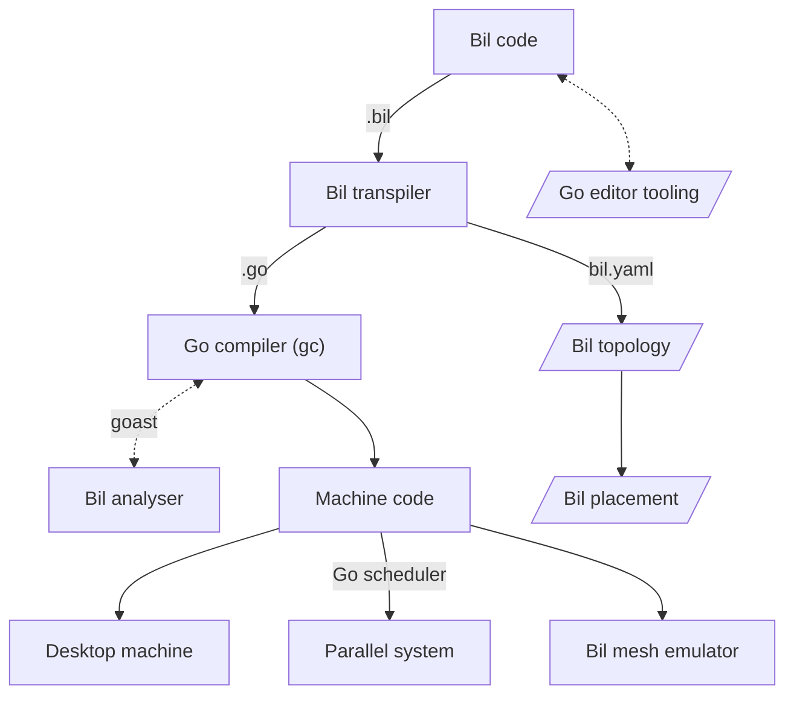

[^^](#top)

---

<a id="further-reading"></a>

### Further reading

- [Hoare, *Communicating Sequential Processes*](http://www.usingcsp.com/cspbook.pdf) — the 1985 book CSP (and occam) is built on; full text free.
- [Roscoe, *The Theory and Practice of Concurrency*](http://www.cs.ox.ac.uk/publications/books/concurrency/) — a more modern, rigorous CSP treatment (refinement, FDR model checking), free PDF via the book's own page.
- [INMOS *occam 2 Reference Manual*, via Kent's occam-for-all project](http://www.cs.kent.ac.uk/projects/ofa/occam-pi/) — the official language spec, plus the ongoing occam-π (mobile channels) successor.
- [Peter Welch, University of Kent](http://www.cs.kent.ac.uk/~P.H.Welch/) — decades of *Communicating Process Architectures* (CPA/WoTUG) papers: farms, pipelines, dining philosophers, barriers, token rings, semaphores-from-channels — the closest existing match to this doc's example bank.
- [Rob Pike, "The Implementation of Newsqueak"](http://herpolhode.com/rob/newsqueak.pdf) — Pike's pre-Go language, the direct CSP/occam-influenced ancestor of Go's channels.
- [Rob Pike, "Share Memory By Communicating"](https://go.dev/blog/codelab-share) — Go's own restatement of the no-shared-mutable-memory principle these examples keep re-deriving from first principles.
- [University of Kent, CO538 Anonymous Questions and Answers](https://www.cs.kent.ac.uk/projects/ofa/co538/anonqa/) - occam course examinations

[^^](#top)

---

<a id="section-iv"></a>

## Section IV: Further Bil

<a id="example-10"></a>

### Example 10: Buffer process

Channels can't be buffered, so the answer is an explicit buffer *process* holding an internal queue, using a **guarded `alt`**. That is `(cond) && c -> x` — a boolean condition guard combined with a channel input.

`alt` only supports *input* guards — there's no way to guard on "is anyone ready to receive from me," so a buffer can't offer output the same way it offers input. The standard workaround: the consumer doesn't receive from the buffer directly — it sends a `request` (any value, ignored) to ask for one, which *is* an input guard from the buffer's side, guarded on the queue being non-empty; only then does the buffer perform an ordinary, immediately-ready `out <-`.

```go
package main

const capacity = 2
const total = 7

proc buffer(in <-chan int, request <-chan int, out chan<- int) {
	var queue []int
	var v int
	var emitted = 0

	for emitted < total {
		alt {
			(len(queue) < capacity) && in -> v {
				queue = append(queue, v)
			}
			(len(queue) > 0) && request -> _ {
				out <- queue[0]
				queue = queue[1:]
				emitted++
			}
		}
	}
}

proc producer(in chan<- int) {
	for v := range total {
		in <- v + 1
	}
}

proc consumer(request chan<- int, out <-chan int) {
	var v int

	for range total {
		request <- 0
		out -> v
		println(v)
	}
}

func main() {
	in := make(chan int)
	request := make(chan int)
	out := make(chan int)

	par {
		buffer(in, request, out)
		producer(in)
		consumer(request, out)
	}
}
```

Running it prints `1` through `7` — then **exits cleanly**. Nothing here ever hangs: `buffer`, `producer`, and `consumer` all loop a bounded, shared `total`, so every one of them returns on its own once its share of the work is done — there's no process left permanently blocked for the runtime to worry about, so no `stop` is needed anywhere in this example.

#### Topology

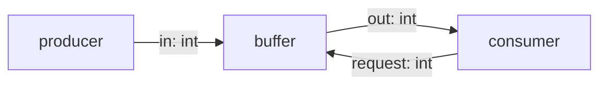

[^^](#top)

---

<a id="example-11"></a>

### Example 11: Dining philosophers

CSP's most famous example. Replicated `par`, shared-resource contention with no shared memory, real constructible deadlock, and the classic fix (asymmetric ordering or an arbitrator process). First example about failure modes, not just happy-path communication. `N = 5` philosophers, `N` forks arranged in a circle — `fork[i]` is philosopher `i`'s left fork and philosopher `i-1`'s right fork — each philosopher eats `MEALS = 2` times, needing both forks held simultaneously to eat. A fork is itself a process, not a shared variable or lock: mutual exclusion falls straight out of a channel only ever completing one rendezvous at a time, no separate synchronization primitive needed. The naive version (every philosopher picks up left then right) is genuinely deadlock-*prone*, not deadlock-*guaranteed* — see below, this took actually running it many times to characterize correctly. The version shown applies the classic fix: one philosopher (arbitrarily, the last) picks up right before left, breaking the circular wait.

```go
package main

const n = 5
const meals = 2

proc fork(acquire <-chan int, release <-chan int) {
	for range 2 * meals {
		acquire -> _
		release -> _
	}
}

proc philosopher(id int, reversed bool, leftAcquire chan<- int, leftRelease chan<- int, rightAcquire chan<- int, rightRelease chan<- int) {
	for range meals {
		if reversed {
			rightAcquire <- 0
			leftAcquire <- 0
		} else {
			leftAcquire <- 0
			rightAcquire <- 0
		}
		println(id, "eating")
		leftRelease <- 0
		rightRelease <- 0
	}
}

func main() {
	acquire := makeChans[int](n)
	release := makeChans[int](n)

	par {
		par i := range n {
			fork(acquire[i], release[i])
		}
		par i := range n {
			philosopher(i, i == n-1, acquire[i], release[i], acquire[(i+1)%n], release[(i+1)%n])
		}
	}
}
```

Running the (asymmetric) version shown: **15/15 trials clean, exit 0, always exactly 10 `eating` lines** (5 philosophers × 2 meals) — count is always right, but *order* varies run to run (genuine contention for shared forks, no FIFO guarantee).

The naive version (every philosopher picks up left then right, no `reversed` exception) is genuinely racy, not deterministically broken: **8 of 15 trials deadlocked** (`fatal error: all goroutines are asleep - deadlock!`, all 5 philosophers stuck on their second `Acquire` send, all 5 forks stuck holding their first `acquire` waiting for a `release` that will never come), **7 of 15 completed cleanly**. First assumption was that it would deadlock every time — wrong, and worth correcting rather than asserting: Go's scheduler doesn't launch all 5 philosopher goroutines in lockstep, so some interleavings let one or more philosophers finish both meals before the symmetric pile-up (everyone grabs left, nobody can get right) actually happens. This is the historically real point of the Dining Philosophers problem — it's not that the naive version always fails, it's that it *can* fail, unpredictably, which is exactly what makes this class of bug dangerous: it can pass testing repeatedly and then deadlock in production.

#### Topology

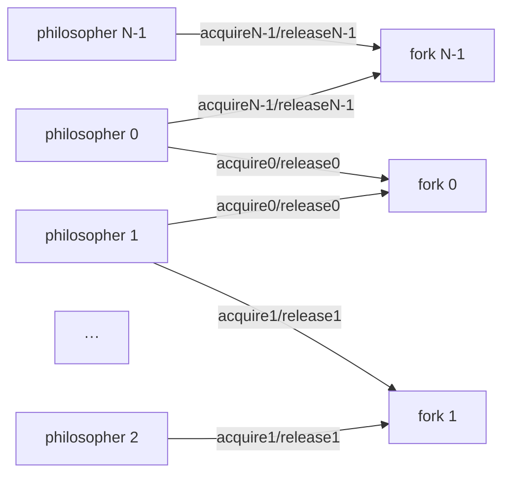

[^^](#top)

---

<a id="example-12"></a>

### Example 12: Recursive processes

A binary tree of processes for parallel reduction. A naturally "processor array"-shaped topology, `reduceSum` sums an array by splitting it in half, recursively summing each half *concurrently* (itself, called again, as two `par` branches), and adding the two partial sums — a binary tree of processes whose depth (`log2(N)`) is set by the input size at runtime, not by any replication count fixed at compile time.

```go
package main

proc reduceSum(data []int, out chan<- int) {
	if len(data) == 1 {
		out <- data[0]
		return
	}
	chunks := splitN(data, 2)
	left := make(chan int)
	right := make(chan int)
	par {
		reduceSum(chunks[0], left)
		reduceSum(chunks[1], right)
		seq {
			var l, r int
			left -> l
			right -> r
			out <- l + r
		}
	}
}

func main() {
	data := []int{1, 2, 3, 4, 5, 6, 7, 8}
	out := make(chan int)
	par {
		reduceSum(data, out)
		seq {
			var total int
			out -> total
			println(total)
		}
	}
}
```

Running it prints `36` (1+2+...+8) — deterministically (checked 5 back-to-back, plus separately confirmed `28` for a 7-element, non-power-of-2 input, proving the split logic generalizes past the balanced-tree case).

#### Topology

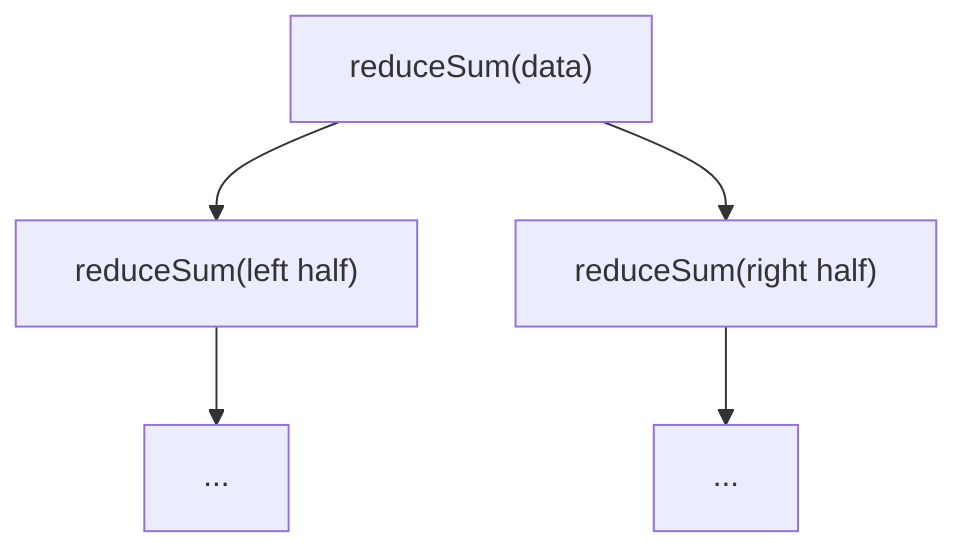

[^^](#top)

---

<a id="example-13"></a>

### Example 13: Pipeline (Sieve of Eratosthenes)

The canonical parallel demo: a chain of N filter processes, each one's output channel is the next one's input. First N-stage topology — everything so far has been 2 processes. A bounded `generator` feeds the pipeline 2..30; each `filter` treats the first value it ever receives as its own prime (printing it), then forwards on every later value that isn't a multiple of that prime. `N = 10` and `LIMIT = 30` are chosen to line up exactly — there are exactly 10 primes ≤ 30 — so every value the generator produces is fully consumed by the 10 filter stages; nothing is left trying to forward past the end of the chain into a void.

```go
package main

const N = 10
const limit = 30

proc generator(out chan<- int) {
	for v := 2; v <= limit; v++ {
		out <- v
	}
	stop
}

proc filter(in <-chan int, out chan<- int) {
	var prime, v int
	seq {
		in -> prime
		println(prime)
		for {
			in -> v
			if v%prime != 0 {
				out <- v
			}
		}
	}
}

func main() {
	c := makeChans[int](N + 1)

	par {
		generator(c[0])
		par i := range N {
			filter(c[i], c[i+1])
		}
	}
}
```

Running it prints `2`, `3`, `5`, `7`, `11`, `13`, `17`, `19`, `23`, `29` — one per line, in that exact increasing order, every run (checked 3+ times back to back) — then hangs forever at ~0% CPU when it hits `stop`.

#### Topology

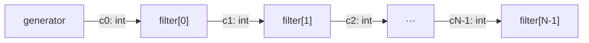

[^^](#top)

---

<a id="example-14"></a>

### Example 14: Poison-pill shutdown cascade

A sentinel value (or done-channel) propagated down a whole pipeline to shut it down cleanly, stage by stage. Directly revisits sieve pipeline example — same `generator`/`filter` shapes, same topology — but where that one left every `filter` blocked forever (avoiding a crash only because `generator` calls `stop`), this one actually terminates: `generator` sends a sentinel (`0`, never a valid candidate) after its real values instead of calling `stop`; each `filter` forwards the sentinel downstream and returns instead of looping forever; a new `sink` process, added specifically so the *last* filter has somewhere to forward the sentinel to, receives it and returns too. Every process now has a real exit — no `stop` anywhere in this version.

```go
package main

const n = 10
const limit = 30
const done = 0

proc generator(out chan<- int) {
	for v := 2; v <= limit; v++ {
		out <- v
	}
	out <- done
}

proc filter(in <-chan int, out chan<- int) {
	var prime, v int
	in -> prime
	println(prime)
	for {
		in -> v
		if v == done {
			out <- done
			return
		}
		if v%prime != 0 {
			out <- v
		}
	}
}

proc sink(in <-chan int) {
	var v int
	for {
		in -> v
		if v == done {
			return
		}
	}
}

func main() {
	c := makeChans[int](n + 1)
	par {
		generator(c[0])
		par i := range n {
			filter(c[i], c[i+1])
		}
		sink(c[n])
	}
}
```

Running it prints the same 10 primes as Example 13, in the same order (`2 3 5 7 11 13 17 19 23 29`) — deterministically and then **exits cleanly**.

#### Topology

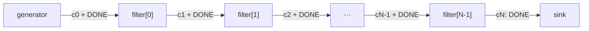

[^^](#top)

---

<a id="example-15"></a>

### Example 15: Semaphore process

Build P/V from just channels + `alt`" idiom — a reusable synchronization primitive built from scratch. `nClients = 3` clients each acquire-then-release a shared counting semaphore (`maxCount = 2`) `cycles = 2` times; the semaphore process holds no separate request/release channel pair per client — just one channel each — and tells the two apart from its own per-client `held[i]` state, not from anything the client says. Uses replicated `alt i := range nClients` directly, plus the per-replica guard added to it afterward: the guard `(held[i] || count > 0)` is what actually enforces "never grant more than `maxCount` concurrent holders," not any check *after* a message is received (by the time a message's been received, the rendezvous already happened — refusing it would be too late).

"P/V" refers to Dijkstra's original semaphore operations — the two primitive operations that define a counting semaphore:
  - P (from Dutch proberen, "to try") — the acquire/wait operation. A process calls P to try to take a unit of the resource: if the semaphore's count is above zero, it decrements the count and proceeds; if the count is zero, the process blocks until someone releases.
  - V (from Dutch verhogen, "to increment") — the release/signal operation. A process calls V to give back a unit of the resource: it increments the count and, if anyone was blocked waiting, lets one of them proceed.

```go
package main

const nClients = 3
const maxCount = 2
const cycles = 2

proc client(id int, sem chan<- bool) {
	for range cycles {
		sem <- true
		sem <- true
	}
}

proc semaphore(chans []chan bool) {
	count := maxCount
	held := make([]bool, nClients)
	for range nClients * cycles * 2 {
		alt i := range nClients {
			(held[i] || count > 0) && chans[i] -> _ {
				if held[i] {
					held[i] = false
					count++
					println("RELEASE", i)
				} else {
					held[i] = true
					count--
					println("ACQUIRE", i)
				}
			}
		}
	}
}

func main() {
	chans := makeChans[bool](nClients)
	par {
		par i := range nClients {
			client(i, chans[i])
		}
		semaphore(chans)
	}
}
```

Running it: **30/30 runs checked, invariant held every time** — trace-analyzed each run's acquire/release sequence (running count never exceeds `maxCount = 2`, never goes negative, ends each run balanced at 0) and confirmed the totals match what's expected (180 acquires / 180 releases across 30 runs = 3 clients × 2 cycles × 30, exactly). Not a degenerate mutex-in-disguise: 83 of those 30 runs had at least one moment of genuinely 2 concurrent holders (checked directly, not assumed) — the semaphore really does let a second client in while the first is still holding, not just alternating one-at-a-time. Non-deterministic interleaving (which client acquires/releases when), real concurrent contention among clients.

#### Topology

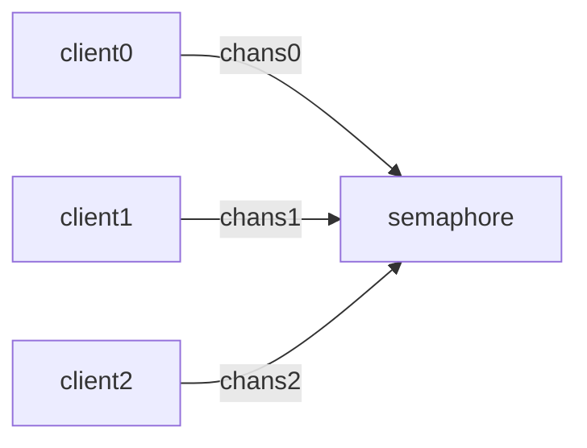

[^^](#top)

---

<a id="example-16"></a>

### Example 16: Barrier synchronization

N-way mid-computation rendezvous — all N processes must arrive before any proceeds. Common in iterative/stencil array codes. Orthogonal to `par`'s end-of-process join, which is only ever a one-time, end-of-execution synchronization: `nWorkers = 3` workers each do `rounds = 3` rounds of "work" (here, just printing), and none may start round *r+1* until every worker has finished round *r* — a repeated, mid-run rendezvous, not the single end-of-execution one `par` already gives for free.

```go
package main

const nWorkers = 3
const rounds = 3

proc worker(id int, arrive chan<- bool, release <-chan bool) {
	for r := range rounds {
		println("worker", id, "round", r)
		arrive <- true
		release -> _
	}
}

proc barrier(arrive []chan bool, release []chan bool) {
	for range rounds {
		for i := range nWorkers {
			arrive[i] -> _
		}
		for i := range nWorkers {
			release[i] <- true
		}
	}
}

func main() {
	arrive := makeChans[bool](nWorkers)
	release := makeChans[bool](nWorkers)
	par {
		par i := range nWorkers {
			worker(i, arrive[i], release[i])
		}
		barrier(arrive, release)
	}
}
```

Running it: **20/20 runs checked, invariant held every time** — trace-analyzed each run's print order (every worker's "round *r*" line appears before every worker's "round *r+1*" line, for every *r*). The *within*-a-round order is still genuinely non-deterministic (which of the 3 workers prints first varies run to run, real concurrent contention).

#### Topology

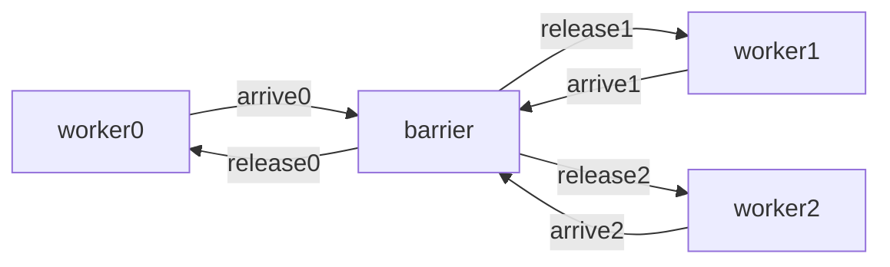

[^^](#top)

---

<a id="example-17"></a>

### Example 17: Token ring

Ring topology, distributed coordination via token passing (mutual exclusion or leader election). `nNodes = 4` peer processes, wired in a cycle (each node's `out` is the next node's `in`), pass a single `int` token around for `rounds = 2` full laps, incrementing it each hop — no distinguished server/collector process this time - every node here runs the identical `node` `proc`, just parameterized by `id`.

```go
package main

const nNodes = 4
const rounds = 2

proc node(id int, in <-chan int, out chan<- int) {
	if id == 0 {
		out <- 0
	}
	for r := range rounds {
		var token int
		in -> token
		println("node", id, "token", token)
		if id == 0 && r == rounds-1 {
			continue
		}
		token++
		out <- token
	}
}

func main() {
	ring := makeChans[int](nNodes)
	par i := range nNodes {
		node(i, ring[(i+nNodes-1)%nNodes], ring[i])
	}
}
```

Running it: **20/20 runs identical**, exactly `node 1 token 0 / node 2 token 1 / node 3 token 2 / node 0 token 3 / node 1 token 4 / node 2 token 5 / node 3 token 6 / node 0 token 7` every time — genuinely deterministic. With exactly one token live at a time, only one process is ever runnable at any instant; every other node is blocked waiting on its `in`.

#### Topology

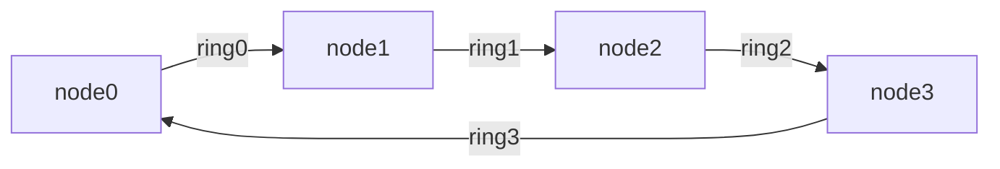

[^^](#top)

---

<a id="example-18"></a>

### Example 18: NxM Mandelbrot

Data-parallel array computation of the Mandelbtor set with a farmer-worker load-balancing pattern. Escape-time cost varies wildly per pixel, so this likely wants dynamic task assignment rather than Example 6's static equal partitioning. `width = 44`, `height = 22` (968 pixels), `nWorkers = 3`: the farmer hands out one pixel at a time to whichever worker's `ALT` fires first, rather than pre-splitting the grid into 3 fixed chunks up front - using "the farmer already knows what a message means from its own bookkeeping" trick (`assigned[w]`), applied to a genuinely data-parallel workload instead of a synchronization primitive. The result is rendered as an actual picture, not a table of numbers: each pixel's escape-time count is bucketed into a 10-level density ramp (`" .:-=+*#%@"`, light to dense) and printed as one character per pixel, one line per row. The complex-plane viewport (`xmin`/`xmax`/`ymin`/`ymax`) is read interactively at startup rather than hardcoded, so the same program can render any region — pan or zoom — without editing source; grid resolution (`width`/`height`), worker count, and iteration cap stay fixed.

```go
package main

import "fmt"

const width = 44
const height = 22
const pixels = width * height
const nWorkers = 3
const maxIter = 30
const done = -1
const ramp = " .:-=+*#%@"

proc worker(id int, xmin, xmax, ymin, ymax float64, assign <-chan int, result chan<- int) {
	var idx int
	assign -> idx
	for idx != done {
		x := idx % width
		y := idx / width
		cx := xmin + float64(x)*(xmax-xmin)/float64(width-1)
		cy := ymin + float64(y)*(ymax-ymin)/float64(height-1)
		zx, zy := 0.0, 0.0
		iter := 0
		for iter < maxIter && zx*zx+zy*zy < 4.0 {
			zx, zy = zx*zx-zy*zy+cx, 2.0*zx*zy+cy
			iter++
		}
		result <- iter
		assign -> idx
	}
}

proc farmer(assign, result []chan int) {
	image := make([]int, pixels)
	assigned := make([]int, nWorkers)
	next := 0
	for w := range nWorkers {
		assigned[w] = next
		assign[w] <- next
		next++
	}
	for range pixels {
		alt w := range nWorkers {
			result[w] :-> val {
				image[assigned[w]] = val
				if next < pixels {
					assigned[w] = next
					assign[w] <- next
					next++
				} else {
					assign[w] <- done
				}
			}
		}
	}
	for y := range height {
		row := make([]byte, width)
		for x := range width {
			iter := image[y*width+x]
			bucket := iter * (len(ramp) - 1) / maxIter
			row[x] = ramp[bucket]
		}
		println(string(row))
	}
}

func main() {
	var xmin, xmax, ymin, ymax float64
	fmt.Print("xmin (full view -2.0): ")
	fmt.Scan(&xmin)
	fmt.Print("xmax (full view 1.0): ")
	fmt.Scan(&xmax)
	fmt.Print("ymin (full view -1.5): ")
	fmt.Scan(&ymin)
	fmt.Print("ymax (full view 1.5): ")
	fmt.Scan(&ymax)
	fmt.Println()

	assign := makeChans[int](nWorkers)
	result := makeChans[int](nWorkers)
	par {
		par w := range nWorkers {
			worker(w, xmin, xmax, ymin, ymax, assign[w], result[w])
		}
		farmer(assign, result)
	}
}
```

Running it: **matches the earlier fixed-viewport version exactly at the same bounds** (`-2.0 1.0 -1.5 1.5`, the values previously hardcoded — piped as stdin, re-checked byte-for-byte against the known-correct reference) — the parameterization is a straight substitution, no math changed. A genuinely different viewport (`-0.8 -0.4 0.4 0.8`, zoomed into one small region) produces a visibly different, more detailed image, confirming the zoom actually works rather than just accepting-and-ignoring input.

The actual rendered output (`ramp = " .:-=+*#%@"`, light to dense):

```
.....:.....            
                  .......::*:.....          
                ........:=@@@-:.....        
             .......-+-@+@@@@%=*::-..       
          .........:-@@@@@@@@@@@@@:...      
     .....:-::+:::-@@@@@@@@@@@@@@@@*..      
  .......::-@@@@@=+@@@@@@@@@@@@@@@@-...     
 ......::@%@@@@@@@@@@@@@@@@@@@@@@@:....     
 ......::@%@@@@@@@@@@@@@@@@@@@@@@@:....     
  .......::-@@@@@=+@@@@@@@@@@@@@@@@-...     
     .....:-::+:::-@@@@@@@@@@@@@@@@*..      
          .........:-@@@@@@@@@@@@@:...      
             .......-+-@+@@@@%=*::-..       
                ........:=@@@-:.....        
                  .......::*:.....          
                     .....:.....
```

Recognizably the Mandelbrot set cardioid-and-bulbs shape.

Zoomed into `xmin -0.8 xmax -0.4 ymin 0.4 ymax 0.8` — a small region along the boundary, entered at the same prompt:

```
:::::::::-----==*@@@@@@@@@@@@@@@@@@@@@@@@@@@
::::::::::---==@@@@@@@@@@@@@@@@@@@@@@@@@@@@@
::::::::::-==@#@@@@@@@@@@@@@@@@@@@@@@@@@@@@@
.:::::::::-=+%@@%@#@@**@@@@@@@@@@@@@@@@@@@@@
....::::::#+-=@@@+=====@@@@@@@@@@@@@@@@@@@@@
.......:::::::--%*=---=*@@*@@@@@@@@@@@@@@@@@
.........::::::::--------==+**%@@@@@@@@@@@@@
..........::::::::::-----=+@@@@@@@@@@@@@@@@@
...........::::::::::--#*#@@@@@@@@@@@@@@@@@@
............:::::::::---*@#@@@@@@@@@@##@@@@@
.............:::::::----==*@@@@@@@@@@*++*@@@
..............:::::*==+==+%@@@@@@@@@+====@@+
..............::::::*=*@@*@@#@@++@@*+-----==
...............:::::---=##%@*==-----------#@
................:::*-#@=-+==@@+----::::::---
.................:--++-:::---#*@-::::::::::-
...................::::::::::=::::::::::::::
.........................:::::::::::::::::::
.......................................:::::
..........................................::
............................................
............................................
```

Genuinely different boundary detail, not the same picture cropped — confirms the viewport is actually driving the computation.

#### Topology

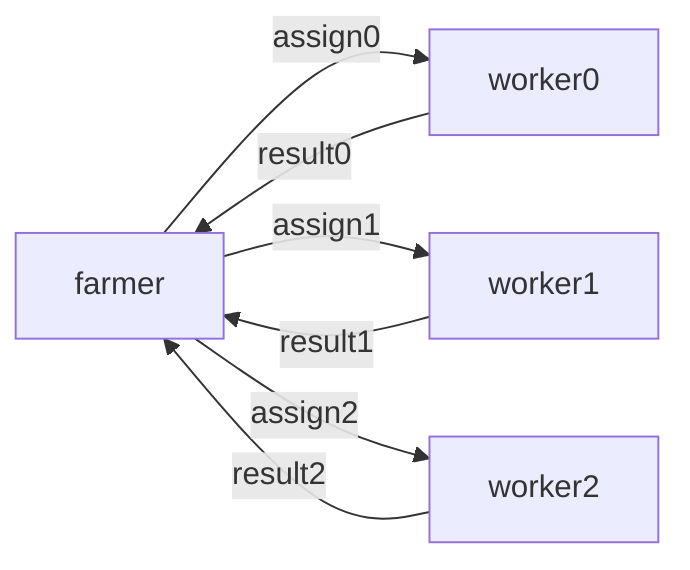

[^^](#top)

---

## License

Copyright (c) 2026 Stephen Roe. BSD 3-Clause license -- see `LICENSE`. See `NOTICE` for the occam/CSP and Go influences and attributions (Go's own license text is in `LICENSE-GO`).
